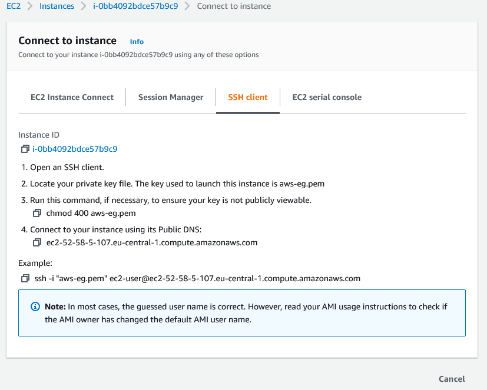
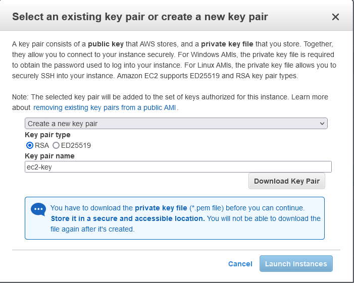
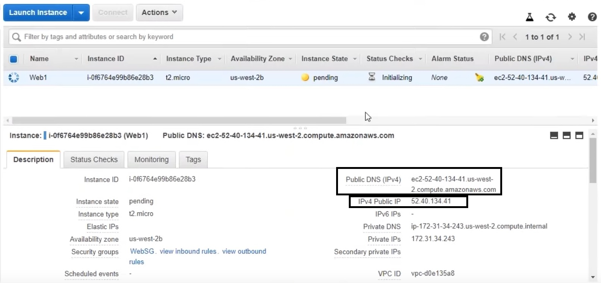
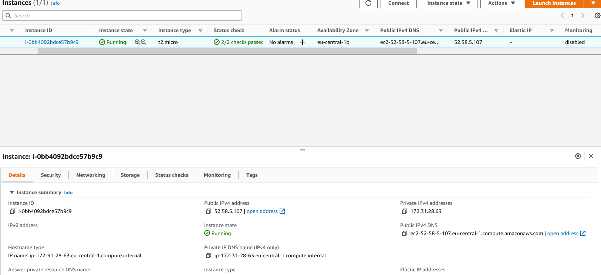

[ec-launch](ec2-launch.md) ile Amazon AMI kullanan bir sunucu oluşturduysanız bağlanmak için aşağıdaki yönergeleri takip edebilirsiniz.

### Linux/Mac Kullanıcıları 

1. Terminal uygulaması açılır ve  **cd** komutu ile **pem** dosyasının olduğu dizine gidilir.
2. `ssh -i /path/to/your/keypair.pem user@server-ip` komutu yazılır.
2.1 Örneğin: `ssh -i /home/youruser/keypair.pem ec2-user@123.123.123.123`
3. Unprotected private key file hatası almanız durumunda `chmod 400  /home/youruser/keypair.pem` komutu yazılır ve çıkan mesaja *yes* denilerek sunucuya bağlanılır.

Ayrıca instance'a sağ tıklayıp (ya da actions menüsünden) connect derseniz ssh sekmesi altında hazır kodu bulabilirsiniz. (Yeni arayüzde **SSH Client** sekmesi).

Eski Arayüz ⚠


Yeni Arayüz ✔


### Windows Kullanıcıları
Windows kullanıyorsanız eğer putty.exe ve puttygen.exe indirmeniz gerekmektedir. Putty kullanarak nasıl ssh yapacağınız [AWS](https://docs.aws.amazon.com/AWSEC2/latest/UserGuide/putty.html) sayfasında anlatılmıştır.

Putty indirmek için;
* [MSI installer (Putty ve puttygen bir arada)](https://www.puttygen.com/download-putty)
* [putty.exe](https://puttygen.com/download.php?val=13)
* [puttygen.exe](https://puttygen.com/download.php?val=49)

Bir diğer alternatif ise Windows 10 altında kullanılabilen WSL2. 

EC2 key-pair oluştururken gerekli ayarlar;

Eski Arayüz ⚠


Yeni Arayüz ✔


<!--  -->

<br>
<br>

**Puttygen** açılır ve **Load** butonuna basılır. Açılan ekrandan **All Files** seçilir. 


<br>

All files seçildikten sonra AWS'ten indirilen *.pem* uzantılı dosya seçilir. 


**OK** butonuna tıklanır ve **Save private key** denilerek oluşturulan private key yeni bir isim verilerek kaydedilir (.ppk uzantılı olacak).

Sonraki adımda **putty.exe** açılır ve host name kısmına instance'a ait bağlantı adresi (Public DNS) girilir. (Connection type **SSH** olmalıdır).

Bağlantı adresi: `ec2-user@public-dns`

Public DNS 👇🏻
Eski Arayüz ⚠


Yeni Arayüz ✔



Host kısmına instance'a ait bağlantı adresi girilir. (Connection type **SSH** olmalıdır).


<!--  -->

<br>

Sol menüde bulunan **SSH** sekmesine gidilir ve **browse** denilerek kaydedilen **private key** seçilir ve altta bulunan **Open** butonuna tıklanır. 

<!--  -->


<br>

Herhangi bir hata almadıysanız sunucuya bağlandığında terminal açılır.


Sunucuya bağlandıktan sonra metadata'yı çekmek için;

```
curl http://169.254.169.254/latest/meta-data/
curl http://169.254.169.254/latest/meta-data/instance-id
curl http://169.254.169.254/latest/meta-data/instance-type
curl http://169.254.169.254/latest/meta-data/public-ipv4
```


User Data için;
```
curl http://169.254.169.254/latest/user-data
```

> ## Çalışmanız bittikten sonra **Instances** sekmesi altından sunucuyu kapatmayı (Terminate) unutmayın!