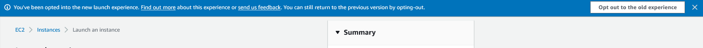
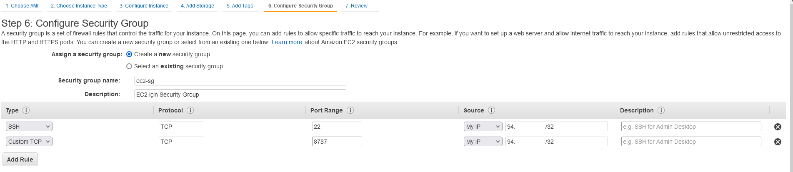
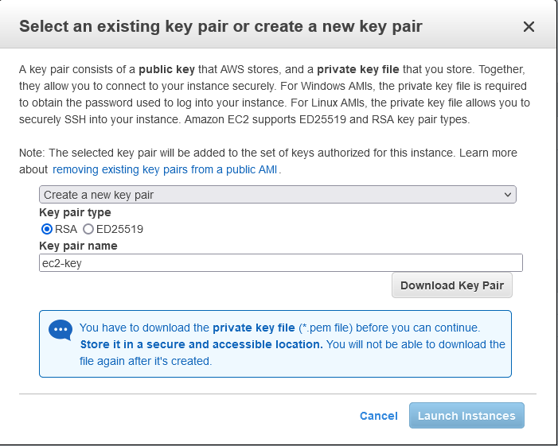

### EC2 ile sunucu oluşturulması

1. EC2 sayfasına gidilir ve **Launch Instance** butonuna tıklanır.
2. *Opt out to the old experience* butonuna tıklanır.

3. İlk adım olan *Step 1: Choose an Amazon Machine Image (AMI)* adımında en üstte bulunan **Amazon Linux 2 AMI (HVM) - Kernel 5.10, SSD Volume Type** seçilir ve Next denir.
4. İkinci adım olan sunucu seçimi sayfasından t2.mico (Free tier eligible) seçilir ve Next denir.
5. Üçüncü adım olan sunucu ayarları sayfasında herhangi bir değişiklik yapılmadan Next denir.
6. Dördüncü adımda depolama için EBS volume oluşturulmaktadır, varsayılan değer olan 8 GB olarak seçilir ve Next denir.
7. Beşinci adımda bir değişiklik yapılmadan Next denir.
8. Altıncı adımda güvenlik grubu oluşturulması için *Create a new security group* seçilir ve isim verilir (ec2-sg). Varsayılan olarak 22 port'u *anywhere* olarak her yere açık gelmektedir. Source altından bu seçenek My IP olarak değiştirilir. Eğer farklı bir port'a izin verilmesi gerekiyorsa (RStudio için 8787, JupyterLab için 8888 gibi); 
    8.1 Add Rule denir ve **Custom TCP** seçilir.  
    8.2 İlgili port için (8787) *Port Range* değeri girilir ve *Source* **My IP** olarak değiştirilir. Review and Launch denir.

9. Son adım olan Launch adımında ayarlar kontrol edilir ve son olarak **Launch** butonuna tıklanır. EC2 sunucusuna bağlanırken güvenli bağlantı gerçekleştirmek için key-pair oluşturulur.
10. Açılır menüden **Create New key-pair** seçilir türü RSA olarak seçilir ve bir isim verilir. Download key-pair butonuna tıklanır, anahtar bilgisayarınıza indirildikten sonra **Launch Instances** butonu aktifleştir. Unutmayın ki anahtarınızı kaybederseniz bir daha bu anahtarı kullanan bir sunucuya bağlanamazsınız!.

> Daha önce oluşturduğunuz key-pair var ise açılır menüden *Choose an existing pair* seçeneğini seçebilirsiniz ve daha önce kullandığınız key-pair ile yeni oluşturacağınız sunucuya erişebilirsiniz. 

Herhangi bir hata almadıysanız sunucu oluşturulmaya başlandı (yaklaşık 2 dakika içinde sunucu ayağa kalkacaktır). Instances sekmesine giderek sunucunun durumunu kontrol edebilirsiniz. **Instance State** Running ve **Status check** sekmesinde 2/2 checks passed yazısını gördüyseniz eğer sunucunuz başarıyla oluşturulmuş demektir.

Oluşturduğunuz sunucuya bağlanmak için [EC2 ile oluşturulan sunucuya bağlanılması](ec2-launch.md) içeriğine göz atabilirsiniz.

> Sunucuya erişirken hata alıyorsanız **Security Groups** altından ilgili portlar (22) için izinleri kontrol edin!.
> ## Çalışmanız bittikten sonra **Instances** sekmesi altından sunucuyu kapatmayı (Terminate) unutmayın!

--- 

EC2 sunucusunun nasıl oluşturulduğuna dair örnek [video](https://youtu.be/Ax37MO6nE2w?t=790)