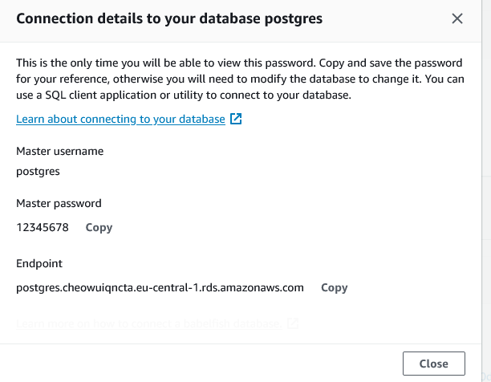

### RDS ile oluşturulan DB'ye bağlanılması ve veri atılması
#### DBeaver

DB'ye erişmek için [DBeaver](https://dbeaver.io/download/) kurulması gereklidir. **Database** -> **New Database** tıklanır, PostgreSQL seçilir ve ilgili alanlar doldurulur.


<br>

**Host**: AWS'teki DB Endpoint
**Database**: postgres
**Username**: postgres
**Password**: DB için belirlediğiniz şifre



Doldurduktan sonra **Finish** ile bağlantı kurulumu tamamlanır ve herhangi bir hata alınmazsa eğer DB'ye erişim sorunsuz bir şekilde tamamlanır.

### Python ile *insert*
Python ([db.py](db.py)) kullanmak isterseniz aşağıdaki paketlerin yüklü olması gerekmektedir.

```
pandas
psycopg2
sqlalchemy
```

Paketleri yüklemek için;
```bash
pip install pandas psycopg2 sqlalchemy 
```

DB oluşturulduktan sonra [db.py](db.py) dosyasındaki `host` ve `password` değişkenleri doldurulduktan sonra komut istemci ile (command prompt) aws-101 klasörüne gidilir ve `python rds\db.py` çalıştırılır.
