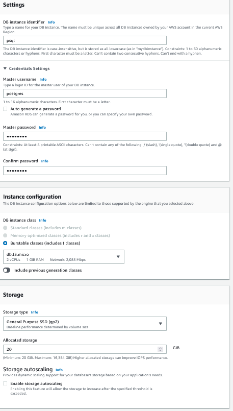
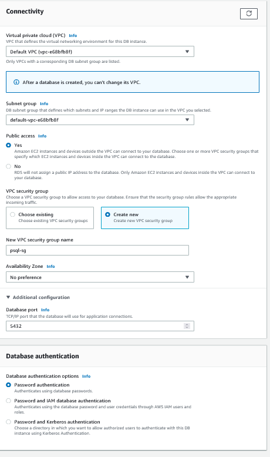
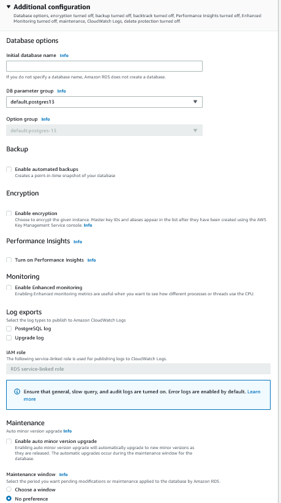
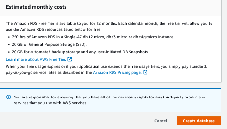
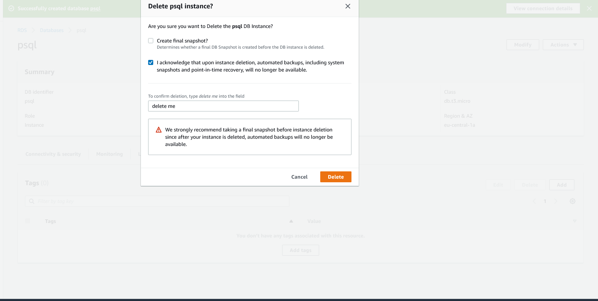

### RDS ile PostgreSQL Free-Tier DB Oluşturulması

1. RDS sayfasına gidilir ve **Create database** butonuna tıklanır. 
2. Database creation method *Standard* olarak seçilir.
3. Engine Type *PostgreSQL* olarak seçilir.
4. Templates altından **Free Tier** seçilir.

5. Settings altından DB Instance identifier ile db'ye istenilen isim verilir. Bu örnekte; *psql*.
    5.1 Master username varsayılan olan *postgres* olarak bırakılır.
    5.2 Master password en az 8 karakter olacak şekilde belirlenir ve onay için bir alttaki kutucukta tekrar yazılır.
6. Instance configuration altından Burstable classes seçilir ve instance tipi **db.t3.micro** (2 vCPUs 1GiB RAM) olarak seçilir.
7. Storage altında **Storage autoscaling** altında bulunan *Enable storage autoscaling* kutucuğu boş bırakılır ve Allocated Storage 20 GB olarak seçilir.

8. Connectivity altında; 
    8.1 VPC ve subnet ayarlarında bir değişiklik yapılmaz.
    8.2 **Publicly accessible** seçeneği **Yes** olarak seçilir.
    8.3 VPC security group için *Create new* denilir ve alttaki kutucuğa güvenlik grubu için isim verilir. 
    8.4 Availability zone *No Prefence* olarak bırakılır.
9. Database authentication *password authentication* olarak seçilir.

10. Additional Configuration altında;
    10.1 *Enable automated backups* kutucuğu boş bırakılır..
    10.2 *Enable encryption* kutucuğu boş bırakılır.
    10.3 *Turn on Performance Insights* kutucuğu boş bırakılır.
    10.4 Maintenance altındaki  *Enable auto minor version upgrade* kutucuğu boş bırakılır.
    10.5 Deletion protection kutucuğu boş bırakılır.
    

Tüm ayarlar aşağıda görsellerdeki gibiyse **Create database** butonuna tıklanır. DB'nin ayağa kalkması yaklaşık 5 dakika sürmektedir. Bu sırada sayfanın üstünde çıkan *View Credential Details* butonuna tıklayarak DB için master kullanıcı adını ve şifresini (DB oluşturulduktan sonra Endpoint'i de) görebilirsiniz.

*View Credential Details 👇🏻*

DB'yi silmek istediğinizde **RDS -> Databases** altından oluşturduğunuz DB'yi seçip Actions altından Delete demeniz yeterli. Silmeden önce DB'nin en güncel hakline ait yedek (snapshot) almak isteyip istemediğinizi soracak. *Create final snapshot* kutucuğunu boş bırakıp *I acknowledge that upon instance deletion, automated backups, including system snapshots and point-in-time recovery, will no longer be available.* kutucuğunu işaretleyerek altta bulunan kutucuğa **delete me** yazarak silme işlemini onaylayın ve sonra **Delete** butonuna tıklayın.

